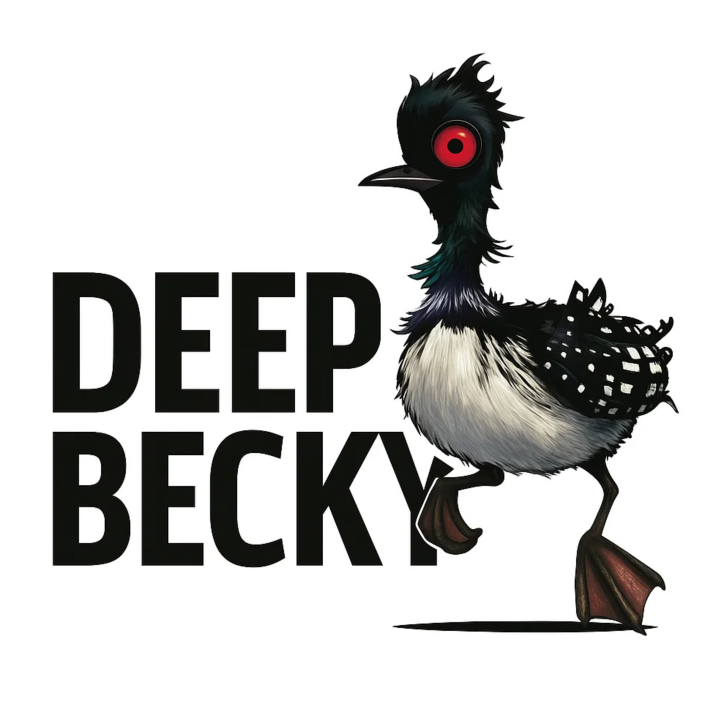

# Deep Becky - UCI Chess Engine



<table>
<tr>
<td>

**Version / Versão:** 0.1  
**Author / Autor:** Diogo de Oliveira Almeida  
**Language / Linguagem:** C++  
**License / Licença:** GNU GPL 3.0

</td>
<td>

</td>
</tr>
</table>

---

## English

### About the Project

Deep Becky was born from a simple question: **"Can AI create a functional UCI chess engine from scratch?"**

Development began around July 2025 using conversations with ChatGPT to create the C++ code. The AI wrote 100% of the code while I provided guidance, testing, feedback, and strategic decisions about next steps.

The path was quite challenging - copying code from chat conversations to Notepad, attempting to compile, facing countless compilation errors, and when it finally compiled, dealing with recognition issues in Fritz. After many attempts and corrections, going through engines that weren't recognized, didn't make moves, or made illegal moves, I finally achieved functional code that respects all chess rules.

This is **version 0.1**, contained in a single `.cpp` file.

### Implemented Techniques

#### Move Generation
- **Complete legal move generation** for all pieces (pawns, knights, bishops, rooks, queens, and kings)
- **Castling** (kingside and queenside) with legal condition verification
- **En passant** with proper rights control
- **Pawn promotion** (to Queen, Rook, Bishop, or Knight)
- Strict legality validation (king cannot remain in check)

#### Search Algorithm
- **Principal Variation Search (PVS)** with null window
- **Iterative Deepening** - progressive depth search
- **Quiescence Search** - capture search to avoid horizon effect
- Maximum depth of 64 plies

#### Search Optimizations
- **Transposition Table** (Hash Table) with 4 million entries
  - Stores evaluated positions with depth, score, and best move
  - TT_EXACT, TT_ALPHA, and TT_BETA flags for different cutoff types
- **Zobrist Hashing** - efficient hash generation for positions
- **Basic repetition detection** (detects 2-fold repetition during search, not full 3-fold)
- **Killer Moves** - stores 2 quiet moves that caused beta cutoff at each ply
- **History Heuristic** - historical move scoring for ordering

#### Move Ordering
Ordering follows this hierarchy:
1. **Transposition Table move** (30000 points)
2. **Captures** ordered by MVV-LVA (Most Valuable Victim - Least Valuable Attacker)
3. **Primary Killer Move** (10000 points)
4. **Secondary Killer Move** (9000 points)
5. **History Heuristic** (accumulated score)

#### Position Evaluation
- **Material values** (pawn=100, knight=320, bishop=330, rook=500, queen=900, king=20000)
- **Bishop pair bonus** (+30 centipawns)
- **Piece-Square Tables** for:
  - Pawns
  - Knights
  - Bishops
  - Rooks
  - King (different tables for middlegame and endgame)
- **Endgame detection** (fewer than 10 non-pawn/non-king pieces)

#### UCI Protocol
Complete UCI (Universal Chess Interface) protocol implementation:
- Commands: `uci`, `isready`, `ucinewgame`, `position`, `go`, `quit`
- FEN support for position setup
- Time management: `wtime`, `btime`, `movetime`, `winc`, `binc`
- Info output: depth, score, nodes, nps, time, principal variation

#### Technical Features
- Adaptive time control (1/30 of remaining time + 4/5 of increment)
- Periodic timeout checking during search
- Node counter
- Complete position history management for undo/redo

### How to Compile

#### Windows (MSVC - Recommended)

Using the provided batch file (generates standalone ~344KB executable):
```bash
build_avx2.bat
```

**Requirements:** Visual Studio 2022 with C++ tools

**Manual compilation:**
```bash
# Open "x64 Native Tools Command Prompt for VS 2022"
cl /nologo /EHsc /Ox /arch:AVX2 /GL /Gy /Gw /GF /Oi /Ob2 /DNDEBUG /MT /std:c++20 deepbecky01.cpp /link /LTCG /OPT:REF /OPT:ICF
```

---

#### Linux / macOS / MinGW (GCC/Clang)

**Dynamic linking (smaller executable, requires system libraries):**
```bash
g++ -O3 -std=c++17 deepbecky01.cpp -o deepbecky
```

**Static linking (larger executable, fully portable):**
```bash
g++ -O3 -std=c++17 -static -static-libgcc -static-libstdc++ deepbecky01.cpp -o deepbecky
```

**With AVX2 support (faster on modern CPUs):**
```bash
g++ -O3 -std=c++17 -march=native deepbecky01.cpp -o deepbecky
```

---

#### Notes

- **C++17 or higher required**
- The MSVC build produces a smaller standalone executable (~344KB) compared to GCC static linking (~1-2MB)
- For tournament/benchmark use, avoid UPX compression (already disabled in `build_avx2.bat`)


### How to Use

The engine works via command line using the UCI protocol. Can be used in graphical interfaces such as:
- Arena Chess GUI
- Fritz
- ChessBase
- Cute Chess
- BanksiaGUI

Manual usage example:
```
./deepbecky
uci
position startpos moves e2e4 e7e5
go movetime 5000
quit
```

### Known Limitations

- Repetition detection is basic (2-fold during search only, not complete 3-fold draw detection)
- No opening book
- No endgame tablebases
- Simple evaluation function
- No null move pruning or late move reductions yet

### Next Steps

This is just the first functional version. Planned improvements include:
- Complete 3-fold repetition detection
- Evaluation tuning
- Search extensions (check extension, etc.)
- Null move pruning
- Late move reductions (LMR)
- Opening book
- Endgame tablebases
- Multi-PV analysis

---

## Português

### Sobre o Projeto

Deep Becky nasceu de uma pergunta simples: **"Será que a IA consegue criar do zero uma engine UCI de xadrez funcional?"**

O desenvolvimento começou por volta de julho de 2025, utilizando conversas com o ChatGPT para criar o código em C++. A IA escreveu 100% do código enquanto eu fornecia orientação, testes, feedback e decisões estratégicas sobre os próximos passos.

O caminho foi bastante desafiador - copiando código das conversas para o Notepad, tentando compilar, enfrentando inúmeros erros de compilação e, quando finalmente compilava, lidando com problemas de reconhecimento no Fritz. Depois de muitas tentativas e correções, passando por engines que não eram reconhecidas, que não faziam movimentos, ou que faziam lances ilegais, finalmente consegui um código funcional que respeita todas as regras do xadrez.

Esta é a **versão 0.1**, contida em um único arquivo `.cpp`.

### Técnicas Implementadas

#### Geração de Movimentos
- **Geração completa de movimentos legais** para todas as peças (peões, cavalos, bispos, torres, damas e reis)
- **Roque** (pequeno e grande) com verificação de condições legais
- **En passant** com controle correto de direitos
- **Promoção de peões** (para Dama, Torre, Bispo ou Cavalo)
- Validação rigorosa de legalidade dos lances (rei não pode ficar em xeque)

#### Algoritmo de Busca
- **Principal Variation Search (PVS)** com janela nula
- **Iterative Deepening** - busca progressiva em profundidade
- **Quiescence Search** - busca de capturas para evitar o efeito horizonte
- Profundidade máxima de 64 plies

#### Otimizações de Busca
- **Tabela de Transposição** (Hash Table) com 4 milhões de entradas
  - Armazena posições já avaliadas com profundidade, pontuação e melhor lance
  - Flags TT_EXACT, TT_ALPHA e TT_BETA para diferentes tipos de corte
- **Zobrist Hashing** - geração eficiente de hash para posições
- **Detecção básica de repetição** (detecta repetição dupla durante a busca, não tripla completa)
- **Killer Moves** - armazena 2 lances silenciosos que causaram corte beta em cada ply
- **History Heuristic** - pontuação histórica de lances para ordenação

#### Ordenação de Movimentos
A ordenação segue esta hierarquia:
1. **Lance da Tabela de Transposição** (30000 pontos)
2. **Capturas** ordenadas por MVV-LVA (Most Valuable Victim - Least Valuable Attacker)
3. **Killer Move primário** (10000 pontos)
4. **Killer Move secundário** (9000 pontos)
5. **History Heuristic** (pontuação acumulada)

#### Avaliação de Posição
- **Valores materiais** (peão=100, cavalo=320, bispo=330, torre=500, dama=900, rei=20000)
- **Bônus de par de bispos** (+30 centipawns)
- **Tabelas de Peça-Quadrado (Piece-Square Tables)** para:
  - Peões
  - Cavalos
  - Bispos
  - Torres
  - Rei (tabelas diferentes para meio-jogo e final)
- **Detecção de final de jogo** (menos de 10 peças não-peão/não-rei)

#### Protocolo UCI
Implementação completa do protocolo UCI (Universal Chess Interface):
- Comandos: `uci`, `isready`, `ucinewgame`, `position`, `go`, `quit`
- Suporte a FEN para configuração de posições
- Gestão de tempo: `wtime`, `btime`, `movetime`, `winc`, `binc`
- Output de informações: profundidade, pontuação, nós, nps, tempo, linha principal

#### Características Técnicas
- Controle de tempo adaptativo (1/30 do tempo restante + 4/5 do incremento)
- Verificação periódica de timeout durante a busca
- Contador de nós visitados
- Gestão completa do histórico de posições para undo/redo

### Como Compilar

#### Windows (MSVC - Recomendado)

Usando o arquivo .bat fornecido (gera executável independente de ~344KB):
```bash
build_avx2.bat
```

**Requisitos:** Visual Studio 2022 com ferramentas C++

**Compilação manual:**
```bash
# Abra o "Prompt de Comando de Ferramentas Nativas x64 do VS 2022"
cl /nologo /EHsc /Ox /arch:AVX2 /GL /Gy /Gw /GF /Oi /Ob2 /DNDEBUG /MT /std:c++20 deepbecky01.cpp /link /LTCG /OPT:REF /OPT:ICF
```

---

#### Linux / macOS / MinGW (GCC/Clang)

**Linkagem dinâmica (executável menor, requer bibliotecas do sistema):**
```bash
g++ -O3 -std=c++17 deepbecky01.cpp -o deepbecky
```

**Linkagem estática (executável maior, totalmente portátil):**
```bash
g++ -O3 -std=c++17 -static -static-libgcc -static-libstdc++ deepbecky01.cpp -o deepbecky
```

**Com suporte AVX2 (mais rápido em CPUs modernas):**
```bash
g++ -O3 -std=c++17 -march=native deepbecky01.cpp -o deepbecky
```

---

#### Observações

- **C++17 ou superior necessário**
- A compilação MSVC produz um executável independente menor (~344KB) comparado à linkagem estática do GCC (~1-2MB)
- Para uso em torneios/benchmarks, evite compressão UPX (já desativada no `build_avx2.bat`)

### Como Usar

A engine funciona através de linha de comando com o protocolo UCI. Pode ser usada em interfaces gráficas como:
- Arena Chess GUI
- Fritz
- ChessBase
- Cute Chess
- BanksiaGUI

Exemplo de uso manual:
```
./deepbecky
uci
position startpos moves e2e4 e7e5
go movetime 5000
quit
```

### Limitações Conhecidas

- Detecção de repetição é básica (apenas dupla durante a busca, não detecta empate por tripla repetição completo)
- Sem abertura book
- Sem tablebases de finais
- Função de avaliação simples
- Ainda sem null move pruning ou late move reductions

### Próximos Passos

Esta é apenas a primeira versão funcional. Melhorias planejadas incluem:
- Detecção completa de tripla repetição
- Ajuste fino dos valores de avaliação
- Extensões de busca (check extension, etc.)
- Null move pruning
- Late move reductions (LMR)
- Abertura book
- Tablebase para finais
- Análise multi-PV

---

## Acknowledgments / Agradecimentos

This project demonstrates the current capabilities of AI-assisted software development. All code was generated by ChatGPT based on human guidance, testing, and iterative feedback.

Este projeto demonstra as capacidades atuais de desenvolvimento de software assistido por IA. Todo o código foi gerado pelo ChatGPT baseado em orientação humana, testes e feedback iterativo.

---

**Note / Nota:** Deep Becky is an experimental project created with AI assistance for educational and research purposes.

Deep Becky é um projeto experimental criado com assistência de IA para fins educacionais e de pesquisa.
