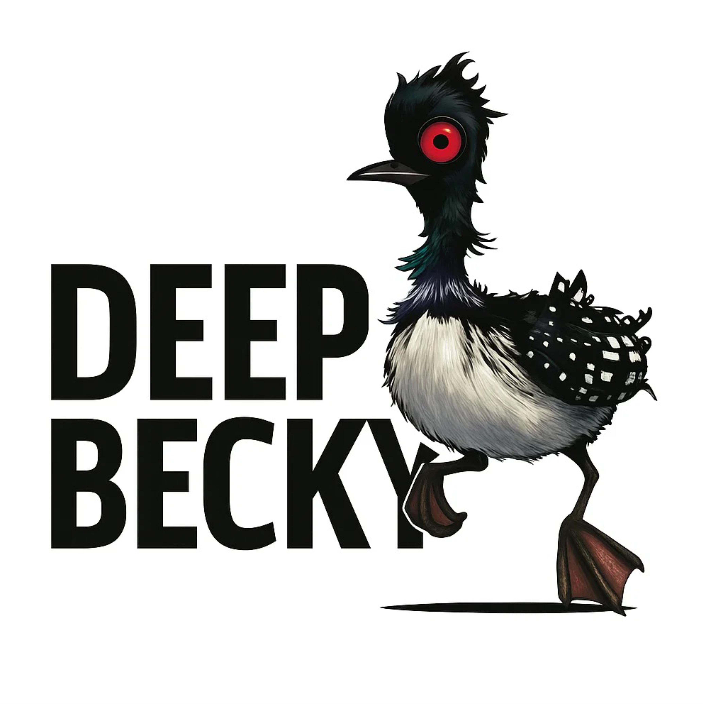

<div align="center">



<h3>Deep Becky - UCI Chess Engine</h3>
Version 1.1 — Draw-Avoidance + Search Improvements
<br>

SEE THE <strong>[LATEST VERSION UPDATE!][changelog]</strong>
<br><br>
<a href="https://lichess.org/@/DeepBecky" target="_blank">
    ♟ BOT Deep Becky on Lichess.org

</div>

---

## English

### About the Project

Deep Becky was born from a simple question: **"Can AI create a functional UCI chess engine from scratch?"**

Development began around July 2025 using conversations with ChatGPT to create the C++ code. The AI wrote 100% of the code while I provided guidance, testing, feedback, and strategic decisions about next steps.

The path was quite challenging - copying code from chat conversations to Notepad, attempting to compile, facing countless compilation errors, and when it finally compiled, dealing with recognition issues in Fritz. After many attempts and corrections, going through engines that weren't recognized, didn't make moves, or made illegal moves, I finally achieved functional code that respects all chess rules.

Version 1.1 builds on the major 1.0 rewrite (full bitboards + magic bitboards) and focuses on practical playing strength and draw handling. The engine now includes robust draw detection (threefold repetition, 50-move, and insufficient material), proactive repetition-cycle handling in search, and **contempt** to avoid unnecessary draws when better positions are available. Move ordering and search internals were also upgraded (MovePicker + SEE, improved TT replacement and generation handling), with stronger UCI/FEN robustness.

Main v1.1 highlights:
- Draw handling: threefold repetition, 50-move rule, insufficient material, and cycle detection
- Draw avoidance: contempt evaluation (+/-20 cp from root side perspective)
- Search ordering: staged MovePicker (TT move, good captures, killers, quiets, bad captures)
- SEE (Static Exchange Evaluation) integrated for capture quality filtering
- Internal performance refactor: compact packed move representation and fixed-size move buffers
- Safer parsing: stronger `setFEN()` validation and case-insensitive UCI command parsing

### How to Compile

#### Windows CMD (MinGW-w64 standalone)

If you have MinGW-w64 installed and available in the system PATH, you can compile directly from the Windows **Command Prompt (cmd)**:

```bash
mingw32-make                        # portable build (default)
mingw32-make PROFILE=avx2           # AVX2 optimized build
mingw32-make PROFILE=bmi2           # AVX2 + BMI2 build
mingw32-make PROFILE=native         # best for your local CPU
```

---

#### MSYS2 MinGW-w64 (Recommended for PGO)

Using the provided Makefile from the **MSYS2 MINGW64** shell:

```bash
make                                # portable build (default, x86-64 generic)
make PROFILE=avx2                   # AVX2 optimized build
make PROFILE=bmi2                   # AVX2 + BMI2 build
make PROFILE=native                 # best for your local CPU
```

**With PGO (Profile-Guided Optimization) for maximum strength:**
```bash
UCI_SCRIPT=$'uci\nisready\nucinewgame\nposition startpos\ngo depth 14\nquit' make profile-build PROFILE=bmi2 LTO_JOBS=8
```

**Or step by step:**
```bash
# Step 1: PGO instrumented build + run profiling workload
UCI_SCRIPT=$'uci\nisready\nucinewgame\nposition startpos\ngo depth 14\nquit' make -f Makefile pgo-gen PROFILE=bmi2 LTO_JOBS=8

# Step 2: Rebuild using collected profile data
make -f Makefile pgo-use PROFILE=bmi2 LTO_JOBS=8
```

**Other useful targets:**
```bash
make clean                          # remove build artifacts
make distclean                      # remove build + PGO data
make info                           # show current build configuration
```

**Requirements:** MSYS2 with `mingw-w64-x86_64-gcc` package installed. Run from the **MSYS2 MINGW64** shell.

---

#### Windows (MSVC)

Using the **x64 Native Tools Command Prompt for VS 2022**:

```bash
cl /nologo /EHsc /O2 /std:c++17 /DNDEBUG /MT /arch:AVX2 main.cpp engine.cpp eval.cpp magic.cpp movegen.cpp search.cpp /Fe:deepbecky-v1.1-windows-x64.exe /link /LTCG /OPT:REF /OPT:ICF
```

**Without AVX2 (broader compatibility):**
```bash
cl /nologo /EHsc /O2 /std:c++17 /DNDEBUG /MT main.cpp engine.cpp eval.cpp magic.cpp movegen.cpp search.cpp /Fe:deepbecky-v1.1-windows-x64.exe /link /LTCG /OPT:REF /OPT:ICF
```

**Requirements:** Visual Studio 2022 with C++ tools

---

#### Linux / macOS (GCC/Clang)

The Makefile works natively on Linux and macOS:

```bash
make                                # portable build
make PROFILE=native                 # native optimized
```

**With PGO:**
```bash
UCI_SCRIPT=$'uci\nisready\nucinewgame\nposition startpos\ngo depth 14\nquit' make profile-build PROFILE=native
```

**Manual compilation (without Makefile):**
```bash
g++ -O3 -std=c++17 -march=native -DNDEBUG -flto main.cpp engine.cpp eval.cpp magic.cpp movegen.cpp search.cpp -o deepbecky
```

**Static linking (fully portable binary):**
```bash
g++ -O3 -std=c++17 -march=native -DNDEBUG -flto -static -static-libgcc -static-libstdc++ main.cpp engine.cpp eval.cpp magic.cpp movegen.cpp search.cpp -o deepbecky
```

---

#### Notes

- **C++17 or higher required**
- The Makefile enables **LTO** (Link-Time Optimization) and **static linking** by default
- **PGO builds** can provide ~5-10% speed improvement (requires MSYS2 or Linux/macOS shell)
- Available profiles: `portable` (default), `avx2`, `bmi2`, `native`


### How to Use

The engine works via command line using the UCI protocol. Can be used in graphical interfaces such as:
- Arena Chess GUI
- Fritz
- ChessBase
- Cute Chess
- BanksiaGUI

## Acknowledgments

This project demonstrates the current capabilities of AI-assisted software development. All code was generated by ChatGPT based on human guidance, testing, and iterative feedback.

---

**Note:** Deep Becky is an experimental project created with AI assistance for educational and research purposes.

---

## Português

### Sobre o Projeto

Deep Becky nasceu de uma pergunta simples: **"Será que a IA consegue criar do zero uma engine UCI de xadrez funcional?"**

O desenvolvimento começou por volta de julho de 2025, utilizando conversas com o ChatGPT para criar o código em C++. A IA escreveu 100% do código enquanto eu fornecia orientação, testes, feedback e decisões estratégicas sobre os próximos passos.

O caminho foi bastante desafiador - copiando código das conversas para o Notepad, tentando compilar, enfrentando inúmeros erros de compilação e, quando finalmente compilava, lidando com problemas de reconhecimento no Fritz. Depois de muitas tentativas e correções, passando por engines que não eram reconhecidas, que não faziam movimentos, ou que faziam lances ilegais, finalmente consegui um código funcional que respeita todas as regras do xadrez.

A versão 1.1 evolui a grande reescrita da 1.0 (bitboards completos + magic bitboards) com foco em força prática e tratamento de empates. A engine agora inclui detecção robusta de empate (tripla repetição, regra dos 50 lances e material insuficiente), tratamento preventivo de ciclos de repetição durante a busca e **contempt** para evitar empates desnecessários quando a posição é favorável. A ordenação de lances e a busca também foram fortalecidas (MovePicker + SEE, melhoria de geração/substituição da TT), além de parser UCI/FEN mais robusto.

Principais destaques da v1.1:
- Tratamento de empate: tripla repetição, regra dos 50 lances, material insuficiente e detecção de ciclos
- Evitar empates: contempt na avaliação (+/-20 cp a partir da perspectiva do lado na raiz)
- Ordenação de busca: MovePicker em estágios (lance da TT, boas capturas, killers, quiets, capturas ruins)
- SEE (Static Exchange Evaluation) integrado para filtrar qualidade de capturas
- Refatoração interna de performance: representação compacta de lance e buffers fixos de movimentos
- Parsing mais seguro: validação mais forte em `setFEN()` e comandos UCI case-insensitive

### Como Compilar

#### Windows CMD (MinGW-w64 standalone)

Se você tem o MinGW-w64 instalado e disponível no PATH do sistema, pode compilar diretamente pelo **Prompt de Comando (cmd)** do Windows:

```bash
mingw32-make                        # build portátil (padrão)
mingw32-make PROFILE=avx2           # build otimizado para AVX2
mingw32-make PROFILE=bmi2           # build AVX2 + BMI2
mingw32-make PROFILE=native         # melhor para sua CPU local
```

---

#### MSYS2 MinGW-w64 (Recomendado para PGO)

Usando o Makefile fornecido no shell **MSYS2 MINGW64**:

```bash
make                                # build portátil (padrão, x86-64 genérico)
make PROFILE=avx2                   # build otimizado para AVX2
make PROFILE=bmi2                   # build AVX2 + BMI2
make PROFILE=native                 # melhor para sua CPU local
```

**Com PGO (Profile-Guided Optimization) para força máxima:**
```bash
UCI_SCRIPT=$'uci\nisready\nucinewgame\nposition startpos\ngo depth 14\nquit' make profile-build PROFILE=bmi2 LTO_JOBS=8
```

**Ou passo a passo:**
```bash
# Passo 1: Build instrumentado PGO + execução para coleta de perfis
UCI_SCRIPT=$'uci\nisready\nucinewgame\nposition startpos\ngo depth 14\nquit' make -f Makefile pgo-gen PROFILE=bmi2 LTO_JOBS=8

# Passo 2: Rebuild usando os dados de perfil coletados
make -f Makefile pgo-use PROFILE=bmi2 LTO_JOBS=8
```

**Outros targets úteis:**
```bash
make clean                          # remove artefatos de build
make distclean                      # remove build + dados PGO
make info                           # mostra configuração atual de build
```

**Requisitos:** MSYS2 com pacote `mingw-w64-x86_64-gcc` instalado. Execute no shell **MSYS2 MINGW64**.

---

#### Windows (MSVC)

Usando o **Prompt de Comando de Ferramentas Nativas x64 do VS 2022**:

```bash
cl /nologo /EHsc /O2 /std:c++17 /DNDEBUG /MT /arch:AVX2 main.cpp engine.cpp eval.cpp magic.cpp movegen.cpp search.cpp /Fe:deepbecky-v1.1-windows-x64.exe /link /LTCG /OPT:REF /OPT:ICF
```

**Sem AVX2 (compatibilidade mais ampla):**
```bash
cl /nologo /EHsc /O2 /std:c++17 /DNDEBUG /MT main.cpp engine.cpp eval.cpp magic.cpp movegen.cpp search.cpp /Fe:deepbecky-v1.1-windows-x64.exe /link /LTCG /OPT:REF /OPT:ICF
```

**Requisitos:** Visual Studio 2022 com ferramentas C++

---

#### Linux / macOS (GCC/Clang)

O Makefile funciona nativamente no Linux e macOS:

```bash
make                                # build portátil
make PROFILE=native                 # otimizado nativo
```

**Com PGO:**
```bash
UCI_SCRIPT=$'uci\nisready\nucinewgame\nposition startpos\ngo depth 14\nquit' make profile-build PROFILE=native
```

**Compilação manual (sem Makefile):**
```bash
g++ -O3 -std=c++17 -march=native -DNDEBUG -flto main.cpp engine.cpp eval.cpp magic.cpp movegen.cpp search.cpp -o deepbecky
```

**Linkagem estática (binário totalmente portátil):**
```bash
g++ -O3 -std=c++17 -march=native -DNDEBUG -flto -static -static-libgcc -static-libstdc++ main.cpp engine.cpp eval.cpp magic.cpp movegen.cpp search.cpp -o deepbecky
```

---

#### Observações

- **C++17 ou superior necessário**
- O Makefile habilita **LTO** (Link-Time Optimization) e **linkagem estática** por padrão
- **Builds PGO** podem fornecer ~5-10% de melhoria de velocidade (requer MSYS2 ou shell Linux/macOS)
- Perfis disponíveis: `portable` (padrão), `avx2`, `bmi2`, `native`

### Como Usar

A engine funciona através de linha de comando com o protocolo UCI. Pode ser usada em interfaces gráficas como:
- Arena Chess GUI
- Fritz
- ChessBase
- Cute Chess
- BanksiaGUI

## Agradecimentos

Este projeto demonstra as capacidades atuais de desenvolvimento de software assistido por IA. Todo o código foi gerado pelo ChatGPT baseado em orientação humana, testes e feedback iterativo.

---

**Nota:** Deep Becky é um projeto experimental criado com assistência de IA para fins educacionais e de pesquisa.


[changelog]:          https://github.com/diogolov-chess/DeepBecky/releases/latest
