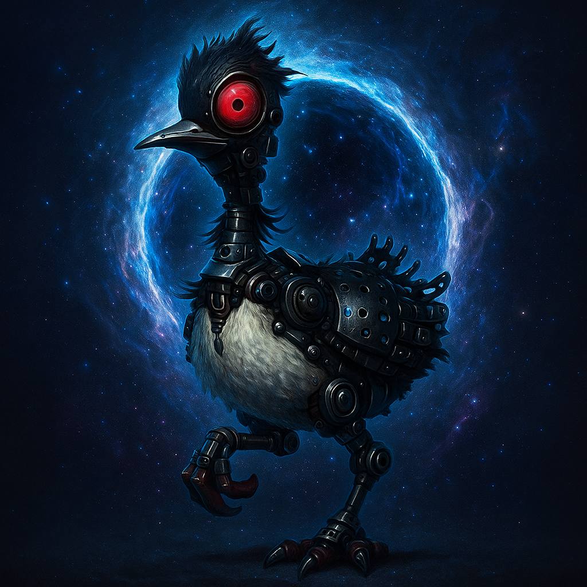

<div align="center">



<h3>Deep Becky - UCI Chess Engine</h3>
Version 2.0 — Lazy SMP Multi-Threading + Singular Extensions
<br>

SEE THE <strong>[LATEST VERSION UPDATE!][changelog]</strong>
<br><br>
<a href="https://lichess.org/@/DeepBecky" target="_blank">
    ♟ BOT Deep Becky on Lichess.org

</div>

---

## English

### About the Project

Deep Becky was born from a simple question: **"Can AI create a functional UCI chess engine from scratch?"**

Development began around July 2025 using conversations with ChatGPT to create the C++ code. The AI wrote 100% of the code while I provided guidance, testing, feedback, and strategic decisions about next steps.

The path was quite challenging - copying code from chat conversations to Notepad, attempting to compile, facing countless compilation errors, and when it finally compiled, dealing with recognition issues in Fritz. After many attempts and corrections, going through engines that weren't recognized, didn't make moves, or made illegal moves, I finally achieved functional code that respects all chess rules.

Today, Deep Becky is developed using **vibe coding** in VSCode, primarily with the AI **Claude Opus** and occasionally **ChatGPT Codex**. This workflow allows for a much faster and more fluid development cycle — writing, refactoring, and debugging code through natural conversation directly in the editor.

Version 2.0 is a **major strength upgrade**, adding **Lazy SMP multi-threading** for parallel search on modern multi-core CPUs. Each thread owns its own Position copy and per-thread heuristic tables (killers, history, pawn hash), communicating only through the shared transposition table — zero contention in hot paths. A **vote-based best thread selection** algorithm combines search depth and score to pick the optimal result across all threads.

The search engine gained several advanced techniques: **Singular Extensions** detect when the TT move is the only good move and extend its search (with double extensions and MultiCut), **ProbCut** prunes positions where a shallow capture search confirms a large beta excess, and **Null Move Verification Search** at high depths prevents zugzwang-related errors. The transposition table was **completely redesigned** with 10-byte entries (down from 16), 3 entries per 32-byte cache-aligned cluster, PV node tracking, and static eval storage that saves full evaluate() calls on TT hits. **Ponder support** was added for continuous analysis during the opponent's turn. Evaluation was enhanced with **incremental PSQT** (piece-square tables updated in makeMove/undoMove), a **non-linear quadratic king safety** model where coordinated attackers are exponentially more dangerous, and **endgame mating evaluation** (KQ vs K, KR vs K) that guides the winning side toward checkmate.

Main v2.0 highlights:
- Lazy SMP multi-threading: UCI `Threads` option (1–256), per-thread tables, vote-based best thread
- Ponder support: continuous analysis during opponent's turn
- Singular Extensions: detect unique best move, double extensions, MultiCut pruning
- ProbCut: shallow capture verification to prune positions far above beta
- Null Move Verification Search: re-search at high depths to prevent zugzwang errors
- Redesigned TT: 10-byte entries, 3-per-cluster (32-byte aligned), PV flag, static eval storage
- Incremental PSQT evaluation: piece-square tables updated in makeMove/undoMove
- Non-linear king safety: quadratic danger scaling with attacker synergy
- Endgame mating evaluation: KQ vs K, KR vs K with king-to-corner guidance
- History heuristic with gravity formula and history malus
- IIR (Internal Iterative Reduction) replacing IID, with cut-node awareness
- Enhanced LMR: history-based, cut-node, singular, and TT-capture adjustments

### How to Compile

#### Windows CMD (MinGW-w64 standalone)

If you have MinGW-w64 installed and available in the system PATH, you can compile directly from the Windows **Command Prompt (cmd)**:

```bash
mingw32-make                        # portable build (default)
mingw32-make PROFILE=avx2           # AVX2 optimized build
mingw32-make PROFILE=bmi2           # AVX2 + BMI2 build
mingw32-make PROFILE=native         # best for your local CPU
```

---

#### MSYS2 MinGW-w64 (Recommended for PGO)

Using the provided Makefile from the **MSYS2 MINGW64** shell:

```bash
make                                # portable build (default, x86-64 generic)
make PROFILE=avx2                   # AVX2 optimized build
make PROFILE=bmi2                   # AVX2 + BMI2 build
make PROFILE=native                 # best for your local CPU
```

**With PGO (Profile-Guided Optimization) for maximum strength:**
```bash
make pgo PROFILE=bmi2
```

**Or step by step:**
```bash
# Step 1: PGO instrumented build + run profiling workload
make pgo-gen PROFILE=bmi2

# Step 2: Rebuild using collected profile data
make pgo-use PROFILE=bmi2
```

**Other useful targets:**
```bash
make clean                          # remove build artifacts
make distclean                      # remove build + PGO data
make info                           # show current build configuration
```

**Requirements:** MSYS2 with `mingw-w64-x86_64-gcc` package installed. Run from the **MSYS2 MINGW64** shell.

---

#### Windows (MSVC)

Using the **x64 Native Tools Command Prompt for VS 2022**:

```bash
cl /nologo /EHsc /O2 /std:c++17 /DNDEBUG /MT /arch:AVX2 main.cpp magic.cpp bitboard.cpp position.cpp movegen.cpp evaluate.cpp search.cpp tt.cpp uci.cpp timeman.cpp movepick.cpp thread.cpp /Fe:deepbecky-v2.0-windows-x64.exe /link /LTCG /OPT:REF /OPT:ICF
```

**Without AVX2 (broader compatibility):**
```bash
cl /nologo /EHsc /O2 /std:c++17 /DNDEBUG /MT main.cpp magic.cpp bitboard.cpp position.cpp movegen.cpp evaluate.cpp search.cpp tt.cpp uci.cpp timeman.cpp movepick.cpp thread.cpp /Fe:deepbecky-v2.0-windows-x64.exe /link /LTCG /OPT:REF /OPT:ICF
```

**Requirements:** Visual Studio 2022 with C++ tools

---

#### Linux / macOS (GCC/Clang)

The Makefile works natively on Linux and macOS:

```bash
make                                # portable build
make PROFILE=native                 # native optimized
```

**With PGO:**
```bash
make pgo PROFILE=native
```

**Manual compilation (without Makefile):**
```bash
g++ -O3 -std=c++17 -march=native -DNDEBUG -flto main.cpp magic.cpp bitboard.cpp position.cpp movegen.cpp evaluate.cpp search.cpp tt.cpp uci.cpp timeman.cpp movepick.cpp thread.cpp -o deepbecky -lpthread
```

**Static linking (fully portable binary):**
```bash
g++ -O3 -std=c++17 -march=native -DNDEBUG -flto -static -static-libgcc -static-libstdc++ main.cpp magic.cpp bitboard.cpp position.cpp movegen.cpp evaluate.cpp search.cpp tt.cpp uci.cpp timeman.cpp movepick.cpp thread.cpp -o deepbecky -lpthread
```

---

#### Notes

- **C++17 or higher required**
- The Makefile enables **LTO** (Link-Time Optimization) and **static linking** by default
- **PGO builds** can provide ~5-10% speed improvement (requires MSYS2 or Linux/macOS shell)
- Available profiles: `portable` (default), `sse42`, `avx2`, `bmi2`, `native`


### How to Use

The engine works via command line using the UCI protocol. Can be used in graphical interfaces such as:
- Arena Chess GUI
- Fritz
- ChessBase
- Cute Chess
- BanksiaGUI

## Acknowledgments

This project demonstrates the current capabilities of AI-assisted software development. The initial versions were created through conversations with ChatGPT, and today the engine is developed using **Claude Opus** and **ChatGPT Codex** via vibe coding in VSCode. All code is AI-generated based on human guidance, testing, strategic decisions, and iterative feedback.

---

**Note:** Deep Becky is an experimental project created with AI assistance for educational and research purposes.

---

## Português

### Sobre o Projeto

Deep Becky nasceu de uma pergunta simples: **"Será que a IA consegue criar do zero uma engine UCI de xadrez funcional?"**

O desenvolvimento começou por volta de julho de 2025, utilizando conversas com o ChatGPT para criar o código em C++. A IA escreveu 100% do código enquanto eu fornecia orientação, testes, feedback e decisões estratégicas sobre os próximos passos.

O caminho foi bastante desafiador - copiando código das conversas para o Notepad, tentando compilar, enfrentando inúmeros erros de compilação e, quando finalmente compilava, lidando com problemas de reconhecimento no Fritz. Depois de muitas tentativas e correções, passando por engines que não eram reconhecidas, que não faziam movimentos, ou que faziam lances ilegais, finalmente consegui um código funcional que respeita todas as regras do xadrez.

Hoje, a Deep Becky é desenvolvida utilizando **vibe coding** no VSCode, principalmente com a IA **Claude Opus** e ocasionalmente com o **ChatGPT Codex**. Esse fluxo de trabalho permite um ciclo de desenvolvimento muito mais rápido e fluido — escrevendo, refatorando e depurando código através de conversa natural diretamente no editor.

A versão 2.0 é uma **grande atualização de força**, adicionando **Lazy SMP multi-threading** para busca paralela em CPUs modernas multi-core. Cada thread possui sua própria cópia de Position e tabelas heurísticas independentes (killers, histórico, hash de peões), comunicando-se apenas pela tabela de transposição compartilhada — zero contenção nos caminhos críticos. Um algoritmo de **seleção do melhor thread por votação** combina profundidade e score para escolher o resultado ótimo entre todas as threads.

A busca ganhou diversas técnicas avançadas: **Singular Extensions** detectam quando o lance da TT é o único bom lance e estendem sua busca (com extensões duplas e MultiCut), **ProbCut** poda posições onde uma busca rasa de capturas confirma grande excesso sobre beta, e **Verificação de Poda de Lance Nulo** em profundidades altas previne erros de zugzwang. A tabela de transposição foi **completamente redesenhada** com entradas de 10 bytes (antes 16), 3 entradas por cluster de 32 bytes alinhado ao cache, rastreamento de nó PV, e armazenamento de avaliação estática que evita chamadas a evaluate() nos acertos da TT. **Suporte a Ponder** foi adicionado para análise contínua durante o turno do oponente. A avaliação foi aprimorada com **PSQT incremental** (tabelas de peça-casa atualizadas em makeMove/undoMove), modelo de **segurança do rei quadrático não-linear** onde atacantes coordenados são exponencialmente mais perigosos, e **avaliação de mate em finais** (KQ vs K, KR vs K) que guia o lado vencedor ao xeque-mate.

Principais destaques da v2.0:
- Multi-threading Lazy SMP: opção UCI `Threads` (1–256), tabelas por thread, seleção por votação
- Suporte a Ponder: análise contínua durante turno do oponente
- Singular Extensions: detecção de lance único, extensões duplas, poda MultiCut
- ProbCut: verificação rasa de capturas para podar posições muito acima de beta
- Verificação de Poda de Lance Nulo: re-busca em profundidades altas para prevenir zugzwang
- TT redesenhada: entradas de 10 bytes, 3 por cluster (32 bytes alinhado), flag PV, eval estática
- Avaliação PSQT incremental: tabelas peça-casa atualizadas em makeMove/undoMove
- Segurança do rei não-linear: escala quadrática de perigo com sinergia de atacantes
- Avaliação de mate em finais: KQ vs K, KR vs K com guia rei-ao-canto
- Heurística de histórico com fórmula de gravidade e malus de histórico
- IIR (Internal Iterative Reduction) substituindo IID, com consciência de nó-corte
- LMR aprimorado: ajustes por histórico, nó-corte, singular e captura TT

### Como Compilar

#### Windows CMD (MinGW-w64 standalone)

Se você tem o MinGW-w64 instalado e disponível no PATH do sistema, pode compilar diretamente pelo **Prompt de Comando (cmd)** do Windows:

```bash
mingw32-make                        # build portátil (padrão)
mingw32-make PROFILE=avx2           # build otimizado para AVX2
mingw32-make PROFILE=bmi2           # build AVX2 + BMI2
mingw32-make PROFILE=native         # melhor para sua CPU local
```

---

#### MSYS2 MinGW-w64 (Recomendado para PGO)

Usando o Makefile fornecido no shell **MSYS2 MINGW64**:

```bash
make                                # build portátil (padrão, x86-64 genérico)
make PROFILE=avx2                   # build otimizado para AVX2
make PROFILE=bmi2                   # build AVX2 + BMI2
make PROFILE=native                 # melhor para sua CPU local
```

**Com PGO (Profile-Guided Optimization) para força máxima:**
```bash
make pgo PROFILE=bmi2
```

**Ou passo a passo:**
```bash
# Passo 1: Build instrumentado PGO + execução para coleta de perfis
make pgo-gen PROFILE=bmi2

# Passo 2: Rebuild usando os dados de perfil coletados
make pgo-use PROFILE=bmi2
```

**Outros targets úteis:**
```bash
make clean                          # remove artefatos de build
make distclean                      # remove build + dados PGO
make info                           # mostra configuração atual de build
```

**Requisitos:** MSYS2 com pacote `mingw-w64-x86_64-gcc` instalado. Execute no shell **MSYS2 MINGW64**.

---

#### Windows (MSVC)

Usando o **Prompt de Comando de Ferramentas Nativas x64 do VS 2022**:

```bash
cl /nologo /EHsc /O2 /std:c++17 /DNDEBUG /MT /arch:AVX2 main.cpp magic.cpp bitboard.cpp position.cpp movegen.cpp evaluate.cpp search.cpp tt.cpp uci.cpp timeman.cpp movepick.cpp thread.cpp /Fe:deepbecky-v2.0-windows-x64.exe /link /LTCG /OPT:REF /OPT:ICF
```

**Sem AVX2 (compatibilidade mais ampla):**
```bash
cl /nologo /EHsc /O2 /std:c++17 /DNDEBUG /MT main.cpp magic.cpp bitboard.cpp position.cpp movegen.cpp evaluate.cpp search.cpp tt.cpp uci.cpp timeman.cpp movepick.cpp thread.cpp /Fe:deepbecky-v2.0-windows-x64.exe /link /LTCG /OPT:REF /OPT:ICF
```

**Requisitos:** Visual Studio 2022 com ferramentas C++

---

#### Linux / macOS (GCC/Clang)

O Makefile funciona nativamente no Linux e macOS:

```bash
make                                # build portátil
make PROFILE=native                 # otimizado nativo
```

**Com PGO:**
```bash
make pgo PROFILE=native
```

**Compilação manual (sem Makefile):**
```bash
g++ -O3 -std=c++17 -march=native -DNDEBUG -flto main.cpp magic.cpp bitboard.cpp position.cpp movegen.cpp evaluate.cpp search.cpp tt.cpp uci.cpp timeman.cpp movepick.cpp thread.cpp -o deepbecky -lpthread
```

**Linkagem estática (binário totalmente portátil):**
```bash
g++ -O3 -std=c++17 -march=native -DNDEBUG -flto -static -static-libgcc -static-libstdc++ main.cpp magic.cpp bitboard.cpp position.cpp movegen.cpp evaluate.cpp search.cpp tt.cpp uci.cpp timeman.cpp movepick.cpp thread.cpp -o deepbecky -lpthread
```

---

#### Observações

- **C++17 ou superior necessário**
- O Makefile habilita **LTO** (Link-Time Optimization) e **linkagem estática** por padrão
- **Builds PGO** podem fornecer ~5-10% de melhoria de velocidade (requer MSYS2 ou shell Linux/macOS)
- Perfis disponíveis: `portable` (padrão), `sse42`, `avx2`, `bmi2`, `native`

### Como Usar

A engine funciona através de linha de comando com o protocolo UCI. Pode ser usada em interfaces gráficas como:
- Arena Chess GUI
- Fritz
- ChessBase
- Cute Chess
- BanksiaGUI

## Agradecimentos

Este projeto demonstra as capacidades atuais de desenvolvimento de software assistido por IA. As versões iniciais foram criadas através de conversas com o ChatGPT, e hoje a engine é desenvolvida utilizando **Claude Opus** e **ChatGPT Codex** via vibe coding no VSCode. Todo o código é gerado por IA baseado em orientação humana, testes, decisões estratégicas e feedback iterativo.

---

**Nota:** Deep Becky é um projeto experimental criado com assistência de IA para fins educacionais e de pesquisa.


[changelog]:          https://github.com/diogolov-chess/DeepBecky/releases/latest
